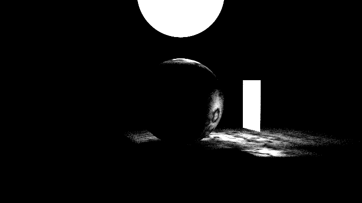

# raytracing
This library is implemented by reading the book: [Ray Tracing in One Weekend](https://raytracing.github.io/books/RayTracingInOneWeekend.html)
It is a rust implementation of the concepts explained.

Below is the image rendered after finishing the book:


Images in the doc_images folder are extracted from the booksite.

To generate the image run the following command:

```
cargo run --release --example rtweekendone
```

Below is the image rendered after finishing the second book:



To generate the image run the following command:

```
cargo run --release --example rtnextweek
```

Most of the images rendered in the book are available as examples
* checkered_spheres
* cornellbox
* cornellbox_with_smoke
* cornellbox_with_two_boxes
* depth_of_field_camera
* earth_scene
* marble_spheres
* rectangle_light_scene
* rtweekendone_moving_spheres_checkered_texture
* wide_angle_camera_scene
