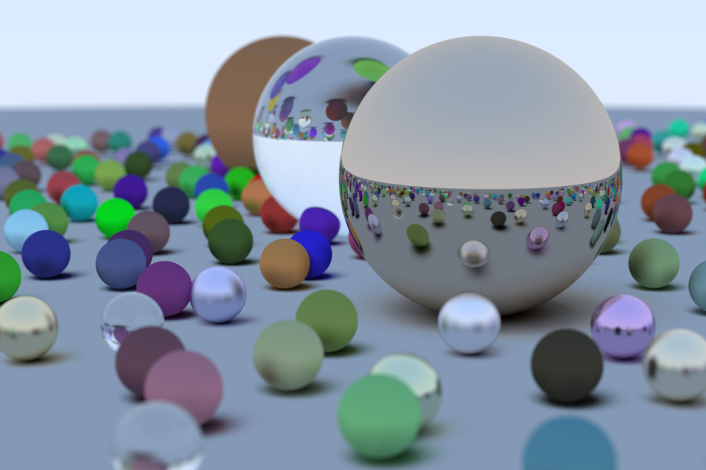

# raytracing
This library is implemented by reading the book: [Ray Tracing in One Weekend](https://raytracing.github.io/books/RayTracingInOneWeekend.html)
It is a rust implementation of the concepts explained.

Below is the image rendered after finishing the book:



Images in the doc_images folder are extracted from the booksite.

To generate the image run the following command:

```
cargo run --release --example rtweekendone > image.ppm
```
